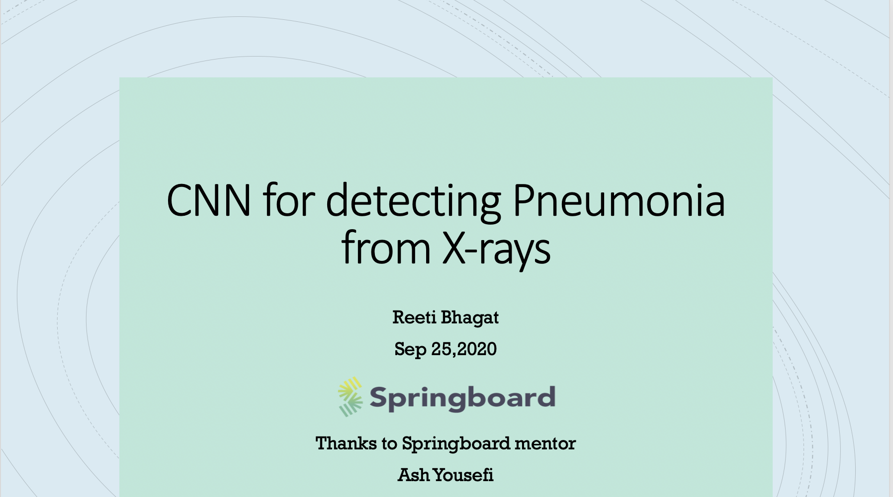
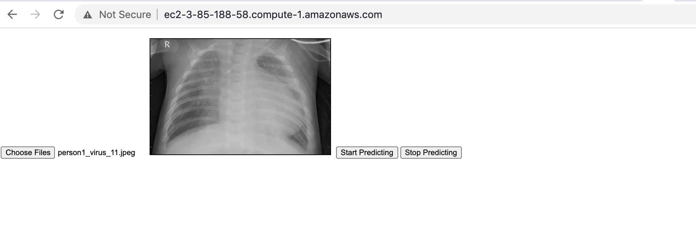
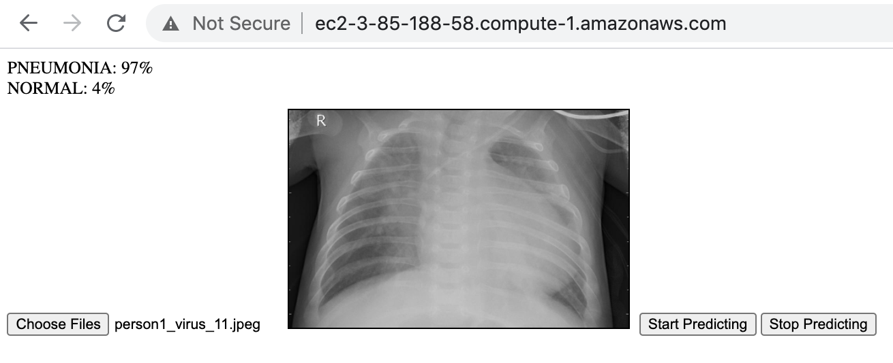

# Capstone-project2
## Deep Learning for detecting Pneumonia from x-ray images and deploying Pneumonia detection Web App with GCP AutoML Vision

In this project, I applied CNN which was built from scratch and transfer learning using VGG16 to the binary classification problem of determining which of two classes ‘ normal’ or ‘pneumonia’ a chest x-ray falls under. First, I applied both of the models to the original x-ray images. The number of images in ‘normal’ class was around 1300 and the number of images in ’pneumonia’ class was around 3800. The accuracy of VGG16 model is 88%  and CNN model is 90%. Then, I build and deploy pneumonia detection Web App with GCP AutoML Vision. The recall is  approximately 96%  and accuracy is 98%.

# About Dataset

The dataset is obtained from www.kaggle.com.

The dataset contains:

5,232 chest X-ray images from children.
3,883 of those images are samples of bacterial (2,538) and viral (1,345) pneumonia.
1,349 samples are healthy lung X-ray images.
The dataset is hosted on Kaggle and can be accessed at Chest X-Ray Images (Pneumonia).

For more in-depth information about my project please refer to the topics below.

1.Project Reports

2.CNN with original images

3.VGG16 with original images

4.Build and deploy Pneumonia detetion Web app with GCP AutoML Vision

5.Project Presentaion

# WEB APP

 Build and deploy pneumonia detection web app with GCP AutoML Vison with Tensorflow.json.
 1. Export tensorflow.js files from gcp to run the model in a web browser. 
 2. Create web app and use tensorflow.js library to call the model to predict image. 
 3. Deploy the web app to AWS Ec2 instance and generated public url to use from anywhere from browser. 
 
 App is running at http://ec2-3-85-188-58.compute-1.amazonaws.com/
 
 ## upload image
 
 
 ## Pneumonia Detection
 
 

